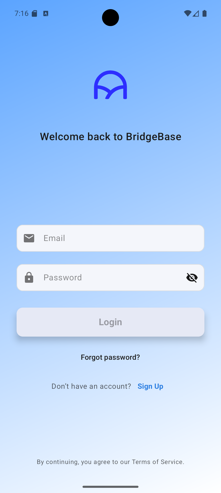
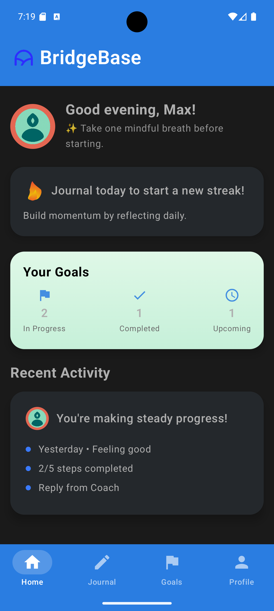
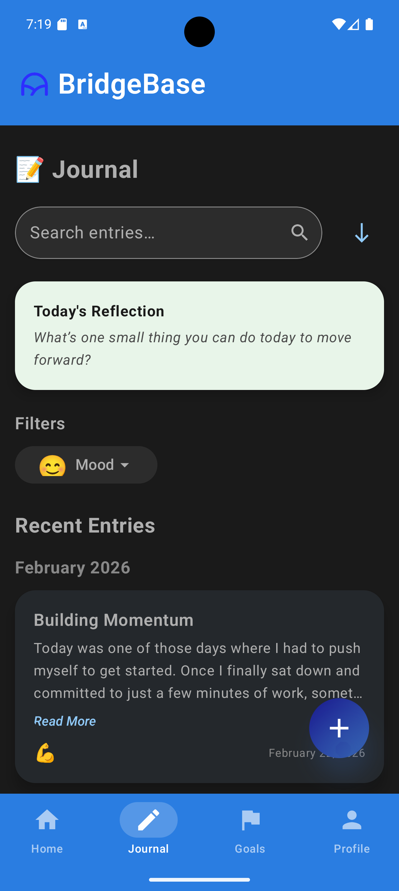
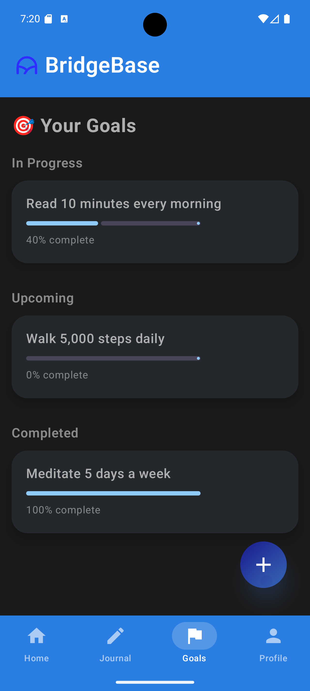
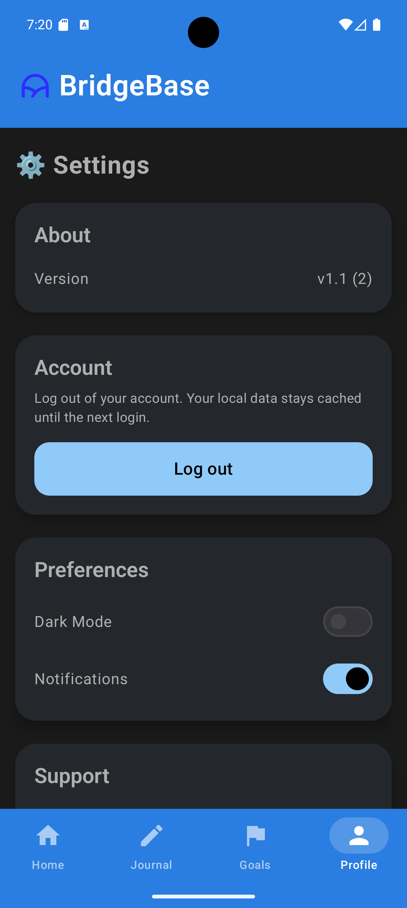

# BridgeBase – Android Jetpack Compose Architecture Example

BridgeBase is a modern Android application demonstrating a scalable architecture built with **Jetpack Compose, MVVM, Hilt dependency injection, and Firebase Authentication**.

The project was originally developed as a starter foundation for building production Android applications and is now open-sourced as a **reference implementation for modern Compose app architecture**.

It demonstrates how to structure a real-world Android application with modular features, repository patterns, reactive UI using **StateFlow**, and dependency injection.

---

# Screenshots

Light and dark theme support with a modular Jetpack Compose architecture.

### Login



### Home Dashboard



### Journal



### Goals



### Settings



---

# Key Features

## Authentication

* Firebase Email/Password authentication
* Auth state observer
* Secure login/logout flow
* Error and loading state handling

## Modern Compose UI

* Jetpack Compose + Material 3
* Light and dark theme support
* Reusable UI components
* Lottie animation support
* Shimmer loading states

## Navigation

* Single-activity architecture
* Jetpack Navigation Component
* Nested navigation graphs
* Shared ViewModels across screens
* Bottom navigation (Home, Journal, Goals, Profile)

---

# Feature Modules

## Home

* Personalized greeting
* Activity feed
* Daily journal call-to-action
* Goals summary card
* Loading placeholders

## Journal

* Entry list
* Search and mood filters
* Add / view entry screens
* Fake repository with Firebase-ready structure

## Goals

* Progress tracking
* Add/edit goals
* Multiple goal states
* Repository pattern implementation

## Settings

* Account overview
* Firebase logout
* App configuration placeholders
* Theme and preference toggles

---

# Tech Stack

## Architecture

* MVVM
* Repository pattern
* StateFlow for reactive UI
* Hilt dependency injection

## UI

* Jetpack Compose
* Material 3
* Lottie animations
* Reusable UI component system

## Data

* Firebase Authentication
* Firestore-ready repository structure
* Fake repositories for local/demo mode

---

# Project Structure

```
app/
 ├── data/
 ├── domain/
 ├── navigation/
 ├── ui/
 │    ├── components/
 │    ├── home/
 │    ├── journal/
 │    ├── goals/
 │    ├── login/
 │    ├── settings/
 │    └── splash/
 ├── theme/
 ├── utils/
 └── services/
```

The structure follows modern Compose architecture practices emphasizing:

* separation of concerns
* modular feature organization
* testability
* scalability

---

# Setup

1. Clone the repository

2. Open the project in **Android Studio**

3. Create a Firebase project

4. Place your Firebase configuration file in:

```
app/google-services.json
```

5. Enable **Email/Password authentication** in Firebase

6. Run the app

---

# Purpose of the Project

BridgeBase demonstrates:

* modern Android architecture patterns
* Jetpack Compose UI development
* dependency injection with Hilt
* repository-based data layer design
* Firebase authentication integration

The project can serve as a **reference architecture for developers building new Android applications using Compose**.

---

# License

This project is released under the **MIT License**.

---

# Author

Rod Bridges
Software Engineer, Backend Platforms & AI Systems
